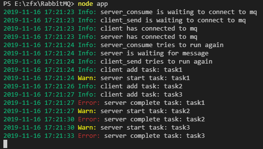

# RabbitMQ
Examples showing how RabbitMQ is used in nodejs

> https://github.com/squaremo/amqp.node

## run  
```bash
cd RabbitMQ
node app
```  

## screenshots


## Consumer messages
There are two ways to consume messages

* Consume: The message is pushed to the Consumer by RabbitMQ.
* Get : The client actively pulls messages from RabbitMQ. You can't loop through 'Get' instead of 'Consume', which can seriously affect performance.